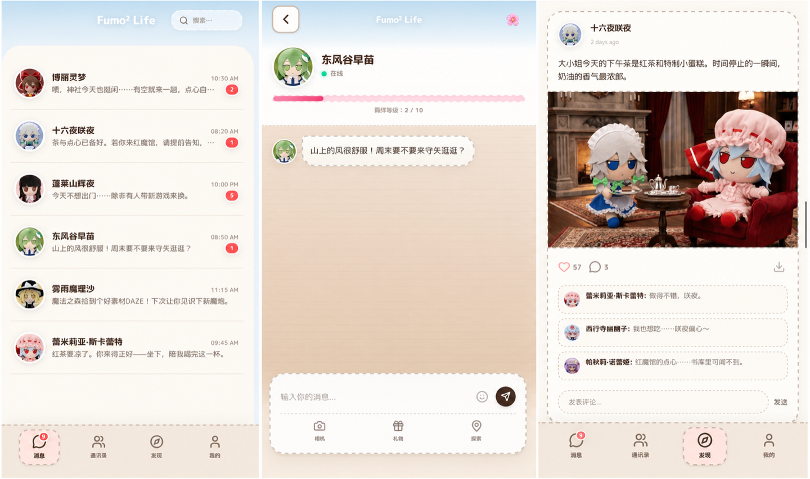

<div align="center">

# Fumo² Life

*Cross the barrier — soft company from Gensokyo in Fumo form* · フモフモ幻想郷

**English** · [简体中文](README.zh-CN.md)

**Live demo:** [fumofumo.life](https://www.fumofumo.life/)


</div>

---

## What it is

**Fumo² Life** is an AI-driven companion app where you live alongside the residents of **Gensokyo** — each one woken up in a **Fumo plush body**. You hold 1:1 conversations with them, watch their day unfold through a **Moments** feed, and keep an **album** of the images you collect along the way.

It ships with **中文 / 日本語 / English** UI, with each character's voice tuned per language.

<div align="center">



<sub>Left to right: the message list, a 1:1 chat with bond level, and the Moments feed with character-posted photos.</sub>

</div>

---

## Not just a chatbot

Most "AI character" apps are one model behind a chat box. Fumo² Life is built around characters, not endpoints:

- **Defined personalities, grounded in canon.** Every resident is written against the *Touhou Project* worldview with their own voice and manner — and **long-term memory** of your shared history, so the relationship carries forward instead of resetting each session.
- **An in-world premise.** They are Gensokyo residents living in **Fumo form** — the roleplay stays warm and daily-life, never leaning on "I'm a plushie" meta. You're not talking to a chat interface; you're keeping company with someone who happens to be in a plush body.
- **A life of their own.** Characters autonomously publish **Moments** — image-and-text snapshots from scenes around the world — and can send you **custom-made photos** in the middle of a conversation.

---

## Features

### Messaging

- **1:1 threads** with each character: typing indicators, gifts, stickers / kaomoji, and **AI-generated scene images** sent in-chat.
- **Distinct voices.** Per-character style prompts plus **anti-repeat** hints keep replies in character and stop different residents from sending the same line. Proactive "incoming" messages share a **cross-character** memory so the cast doesn't copy-paste each other.
- **Bond & memory.** Bond levels, conversation previews, and unread state persist in the cloud; chat history is stored in **Supabase** and mirrored locally so a flaky connection won't wipe the thread you were just reading.

### Moments (Discover)

- A social feed where the cast **autonomously posts** image-and-text moments from varied scenes, mixed with **your own** text/image posts.
- **Likes and comments** — from you, from characters, and AI-written replies on your posts — with unread cues when a character comments on **your** moment.
- User photos are stored as **persisted image data** (not fragile `blob:` URLs), so they still load after a refresh.

### Me & album

- Profile, language switch, privacy blurb, **clear all chats**, and **switch user**.
- The **album** aggregates everything you've collected in-app: Moments artwork, images from your own posts, and the scene photos characters sent you in chat.

### Account & data

- **Register / login** with username + password (hashed client-side; see `supabase/schema.sql` for production-hardening notes).
- **Switch user** ends the session and clears that account's app data plus local caches — a clean **fresh start** when handing the device to another keeper.
- **Near-real-time** updates for messages and moments where Supabase Realtime is enabled.

---

## Character imagery pipeline

The plush imagery is the heart of the experience, so the moments and in-chat photos are produced by a dedicated generation pipeline rather than generic stock art:

- **Per-character LoRA models.** Each character gets a custom LoRA trained from just **15–20 multi-angle references**, trainable and deployable in minutes and designed to scale to **10+ characters** in parallel — so every resident keeps a consistent, recognizable plush identity.
- **ComfyUI + Flux workflow.** A multi-step text-to-image flow with controllable **outfit, scene, lighting, and cross-IP elements**. Each request renders a **batch and auto-selects the best** result to lift quality.
- **Pre-generation pool.** Because high-fidelity generation is slow, a background service keeps a **buffer of ready-to-use assets per character**, so Moments and chat images appear **instantly** instead of waiting on live generation.
- **In-character captioning.** Each image is paired with a caption rewritten **in the character's voice** by a lightweight model, keeping tone consistent while cutting captioning cost dramatically.
- **Resilient storage.** Generated assets are backed up across a local server and cloud object storage, with token-gated access and efficient retrieval at scale.

> The app also supports a **Gemini image model fallback**, so it stays fully functional even without the custom backend configured.

---

## Tech stack

| Area | Choice |
|------|--------|
| Frontend | React 19, Vite, Tailwind, Motion, React Router |
| Conversational AI | Google **Gemini** (`@google/genai`) for chat and moment comments |
| Character imagery | Custom **LoRA + ComfyUI/Flux** pipeline with a pre-generation pool; **Gemini image model** fallback |
| Backend / sync | **Supabase** (Postgres + optional Realtime) |

> Local dev reads `GEMINI_API_KEY`, `VITE_SUPABASE_URL`, and `VITE_SUPABASE_ANON_KEY` from `.env.local`. An optional custom image backend can be wired via the variables in `.env.example`.

---

## Quick start

**Prerequisites:** Node.js (LTS recommended)

```bash
git clone https://github.com/QingMXL/Fumo-Life.git
cd Fumo-Life
npm install
```

Copy the env template and fill in your own keys:

```bash
cp .env.example .env.local
# Edit .env.local — see the file for the full list of variables.
```

Initialize the Supabase tables:

```sql
-- Run all SQL in supabase/schema.sql inside the Supabase SQL Editor
```

Run the dev server:

```bash
npm run dev
```

Other scripts: `npm run build`, `npm run preview`, `npm run lint`.

---

## Contributing

PRs welcome — especially **localized prompt tuning** per character to keep voices distinct and on-lore.

When adding a **new Fumo**, follow the Fumo form spec in the PRD. Strong image prompts usually specify:

- **Form** — high-detail 3D physical plush
- **Materials** — soft pile, velvet, wool, visible stitching
- **Light** — soft side light, diffuse
- **Face** — dot eyes (no highlight catchlights), embroidered mouth, etc.

**Example prompt** (replace `[CHARACTER DETAILS HERE]`):

```text
(Highly detailed 3D rendering:1.2), (soft plush texture with visible velvet and wool fabrics:1.3), handcrafted quality, soft velvet body with fine stitching threads, chibi aesthetic, signature Fumo design with large head and short limbs, round black dot eyes without high reflections, embroidered mouth, photorealistic style, cute and comforting. [CHARACTER DETAILS HERE].
```

---

## Acknowledgements

- **ZUN 上海アリス幻樂団** — *Touhou Project*
- **Fumo designers**

---

## License

MIT License
