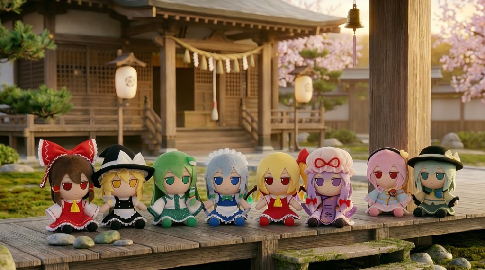

<div align="center">

# Fumo² Life

*Cross the barrier — soft company from Gensokyo in Fumo form* · フモフモ幻想郷

**English** · [简体中文](README.zh-CN.md)

**Live demo:** [fumofumo.life](https://www.fumofumo.life/)



</div>

---

### Introduction

**Fumo² Life** lets you cross the barrier and live next door to Gensokyo residents trapped in **Fumo form**.

It is a cozy, AI-powered raising-style web app. **Nano Banana 2**–class language and image capabilities aim for companionship you can almost feel. You are not clicking a generic doll UI—you are sharing daily life with characters whose personalities and memories stay close to canon, limited only by stubby limbs and stuffing.

> The app talks to models through the **Google Gemini API**. For local development, set `GEMINI_API_KEY` (see Quick Start).

### Visual identity

The art direction is **“soft enough to touch”**, not flat or sticker-like.

1. **Stitching aesthetic (cream UI)**  
   Warm cream palette, linen-like texture, visible stitched edges on cards and bubbles, soft diffuse light and a stacked “plush panel” depth.

2. **Hardcore Fumo look**  
   Avatars, social posts, and travel shots should read as **3D plush** (velvet, wool, stitching), **dot eyes without specular highlights**, and **embroidered features**—never 2D decals.

### Core features

1. **Multilingual “Soul of Fumo”**  
   - **Form, not confession**: first-person daily life without leaning on “I’m a plushie” meta; avoid OOC lines like “as a Fumo” or “pet my fluff.”  
   - **Message splitting**: one thought → 2–3 short bubbles, like real chat pacing.

2. **Internationalization**  
   中文 / 日本語 / English with tone that fits each language (e.g. Japanese keigo where appropriate).

3. **Fumo life**  
   - **Messages** — thread list (Fumo avatars)  
   - **Contacts** — index of characters you’ve met  
   - **Discover** — async “moments” from Gensokyo  
   - **Me** — settings and a Fumo photo gallery (filterable by character)  
   - **Camera** — in-the-moment plush photos  
   - **Explore** — travel mechanics

### Quick start

**Prerequisites:** Node.js (LTS recommended)

```bash
git clone https://github.com/QingMXL/Fumo-Life.git
cd Fumo-Life
npm install
```

Copy the env template and add your Gemini API key:

```bash
cp .env.example .env.local
# Edit .env.local and set GEMINI_API_KEY
```

Run the dev server:

```bash
npm run dev
```

Other scripts: `npm run build`, `npm run preview`, `npm run lint`.

### Contributing

PRs welcome—especially **localized prompt tuning** per character to avoid OOC drift.

When adding a **new Fumo**, follow the Fumo form spec in the PRD. Strong image prompts usually specify:

- **Form** — high-detail 3D physical plush  
- **Materials** — soft pile, velvet, wool, visible stitching  
- **Light** — soft side light, diffuse  
- **Face** — dot eyes (no highlight catchlights), embroidered mouth, etc.

**Example prompt** (replace `[CHARACTER DETAILS HERE]`):

```text
(Highly detailed 3D rendering:1.2), (soft plush texture with visible velvet and wool fabrics:1.3), handcrafted quality, soft velvet body with fine stitching threads, chibi aesthetic, signature Fumo design with large head and short limbs, round black dot eyes without high reflections, embroidered mouth, photorealistic style, cute and comforting. [CHARACTER DETAILS HERE].
```

### Acknowledgements

- **ZUN 上海アリス幻樂団** — *Touhou Project*  
- **Fumo designers**  
 

### License

MIT License
